# ZABBIX

## 1 - Contexte

Dans le cadre de l'épreuve E6 du BTS SIO option SISR (Solutions d'Infrastructure, Systèmes et Réseaux), j'ai mené ce projet sur la plateforme technique de mon établissement, qui reproduit l'environnement d'un système d'information d'entreprise : un domaine Active Directory (bts.lan), des serveurs Linux virtualisés (Zabbix, Vaultwarden, Postfix, DNS...), des postes Windows, des équipements réseau Cisco (routeur et switch) et une baie de stockage TrueNAS.

Avant ce projet, cette infrastructure ne disposait d'aucun outil de supervision centralisé : l'état des serveurs, des postes et des équipements réseau n'était contrôlé que ponctuellement et manuellement, sans historique ni alerte automatique. Une panne, une surcharge (CPU, RAM, disque, réseau) ou un service à l'arrêt ne pouvait donc être détecté qu'a posteriori (généralement lorsqu'un utilisateur signalait un dysfonctionnement) ce qui retarde la résolution des incidents et nuit à la disponibilité du système d'information.

L'objectif de ce projet est donc de mettre en place une solution de supervision centralisée capable de surveiller l'ensemble de ce parc hétérogène (serveurs Linux, postes Windows, équipements réseau, stockage), de remonter automatiquement les anomalies par des alertes (e-mail, Discord) et de visualiser l'état de l'infrastructure via des tableaux de bord (tout en intégrant les exigences de sécurité propres à un environnement d'entreprise (authentification sécurisée, chiffrement des communications et des sauvegardes).

## 2 - Cahier des charges

### Objectif général

Déployer une solution de supervision centralisée (Zabbix) couplée à un outil de visualisation (Grafana), permettant de surveiller l'ensemble du parc informatique de la plateforme technique, de générer des alertes automatiques en cas d'anomalie, et de garantir la sécurité et la pérennité du service mis en place.

### Exigences fonctionnelles

Le système doit permettre de :

- Superviser l'état et les ressources (CPU, RAM, disque, réseau) des serveurs Linux et des postes Windows du domaine ;

- Superviser les équipements réseau (routeur et switch Cisco) et le système de stockage (TrueNAS) via le protocole SNMP ;

- Enregistrer automatiquement les nouveaux hôtes (Linux/Windows) grâce à des règles d'auto-enregistrement basées sur les métadonnées d'agent ;

- Déclencher des alertes automatiques par e-mail et par messagerie instantanée (Discord) lorsqu'un service ou un équipement devient indisponible ;

- Visualiser l'état de l'infrastructure à travers des tableaux de bord graphiques (Grafana) présentant a minima les métriques CPU, RAM, disque et réseau ;

- Sauvegarder régulièrement la configuration et les données du serveur de supervision, de façon chiffrée et automatisée, avec une politique de rétention, et garantir la possibilité de restaurer le service en cas de sinistre.
  

### Exigences techniques et contraintes

- Le serveur de supervision doit être intégré au domaine Active Directory (bts.lan), disposer d'une adresse IP fixe et d'une résolution DNS ;
  
- L'accès aux interfaces web (Zabbix et Grafana) doit être sécurisé en HTTPS, à l'aide de certificats signés par une autorité de certification interne (CA locale) ;

- Les échanges avec les équipements réseau doivent privilégier SNMPv3 (authentification et chiffrement) lorsque le matériel le permet ;

- Les sauvegardes doivent être chiffrées (GPG), envoyées vers un espace de stockage dédié (TrueNAS), journalisées et automatisées (cron) ;

- La solution doit reposer autant que possible sur des outils libres ou disposant d'une édition gratuite (Zabbix, Grafana, MariaDB, Apache).
  

### Livrables attendus

- Une plateforme Zabbix opérationnelle, intégrée à l'AD et accessible en HTTPS ;

- Des hôtes supervisés représentatifs de chaque type d'équipement (Linux, Windows, réseau, stockage) ;
  
- Un système d'alertes fonctionnel testé sur au moins deux canaux (e-mail, Discord) ;
  
- Des tableaux de bord Grafana exploitables par les administrateurs ;

- Un script de sauvegarde automatisé, documenté et testé (sauvegarde et restauration) ;
Une documentation technique permettant de reproduire ou de faire évoluer l'installation.


## 3 - Architecture

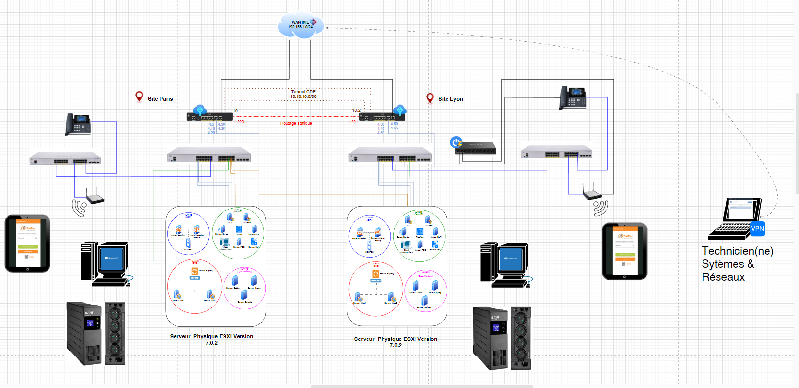
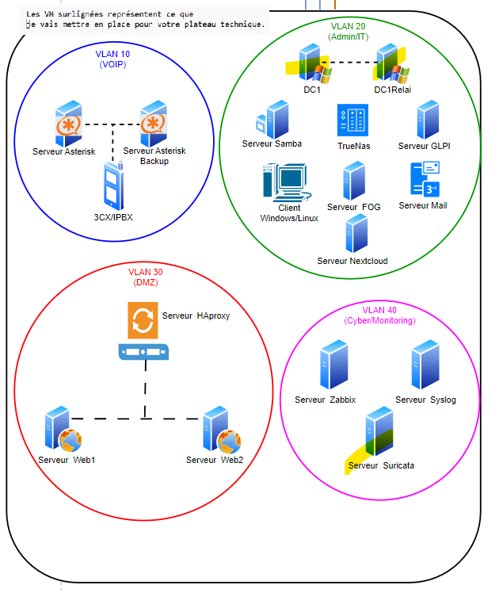

## 4 - Choix techniques

### Outil de supervision : Zabbix

Zabbix a été retenu comme solution de supervision principale car il s'agit d'un outil open source, gratuit, mature et largement utilisé en entreprise. Contrairement à des solutions comme Nagios ou Centreon, Zabbix intègre nativement la découverte et l'enregistrement automatique des hôtes, la gestion des utilisateurs et des notifications, ainsi qu'une API REST complète permettant une intégration aisée avec des outils tiers (notamment Grafana). Il prend également en charge nativement la supervision via agent, SNMP et IPMI, ce qui correspond au parc hétérogène à superviser (serveurs Linux, postes Windows, équipements réseau, stockage).

### Système d'exploitation et base de données

Le serveur a été installé sous Ubuntu, distribution Linux stable, largement documentée et compatible avec les paquets officiels Zabbix. MariaDB a été choisi comme système de gestion de base de données car il s'agit du SGBD recommandé par défaut par Zabbix sur les distributions basées sur Debian/Ubuntu, et qu'il s'agit d'une solution open source pérenne.


### Sécurisation des accès web : PKI interne (CA locale) et HTTPS

Les interfaces web de Zabbix et de Grafana devant rester accessibles uniquement en interne (domaine bts.lan non résolvable publiquement), la mise en place d'une autorité de certification interne a été préférée à un certificat public type Let's Encrypt (qui nécessite une validation par un nom de domaine public). Cette CA locale signe les certificats des deux services, qui sont ensuite servis en HTTPS par Apache (agissant à la fois comme serveur web pour Zabbix et comme reverse-proxy pour Grafana) ce qui garantit la confidentialité et l'intégrité des échanges, et permet de mettre en pratique la gestion d'une infrastructure à clés publiques (PKI).

### Supervision des équipements réseau et du stockage : SNMP

Les équipements réseau (routeur et switch Cisco) et le NAS (TrueNAS) ne pouvant pas recevoir d'agent Zabbix, leur supervision repose sur le protocole SNMP. La version 3 (SNMPv3) a été privilégiée chaque fois que le matériel le permettait, car elle introduit l'authentification et le chiffrement des échanges (authPriv), contrairement à la version 2c qui transmet les informations en clair via une simple chaîne de communauté.

### Enregistrement automatique des hôtes

Des règles d'auto-enregistrement basées sur les métadonnées d'agent (HostMetadata=Linux / Windows) ont été mises en place afin de simplifier l'intégration de nouveaux hôtes dans Zabbix : dès qu'un agent est installé et configuré, la machine est automatiquement ajoutée, classée dans le bon groupe d'hôtes et associée au bon modèle de supervision, sans intervention manuelle sur le serveur.

### Visualisation : Grafana

Bien que Zabbix propose ses propres tableaux de bord, Grafana a été ajouté à l'infrastructure car il offre des possibilités de visualisation plus avancées et personnalisables, et constitue un outil largement répandu dans le monde professionnel. La connexion entre les deux outils s'appuie sur le plugin officiel Zabbix pour Grafana et un jeton d'API dédié, associé à un compte Zabbix en lecture seule (principe du moindre privilège).

### Alerting multicanal : e-mail et Discord

Deux canaux d'alerte complémentaires ont été configurés : l'e-mail (via Gmail/SMTP), canal universel et professionnel, et Discord (via webhook), qui permet une notification quasi instantanée et facilement consultable depuis un poste ou un mobile. Cette redondance limite le risque de manquer une alerte critique si l'un des deux canaux est indisponible.

### Sauvegarde : script shell, chiffrement GPG et planification cron

Plutôt que de recourir à un outil de sauvegarde tiers, un script shell générique a été développé afin de répondre précisément aux besoins du projet (sauvegarde de la configuration, des données utilisateurs et des bases MariaDB, envoi vers le NAS, rotation, journalisation). Les sauvegardes sont chiffrées avec GPG avant d'être stockées sur le NAS, afin de garantir leur confidentialité même en cas d'accès non autorisé au support de stockage. La planification est assurée par cron, solution standard, simple et fiable sous Linux pour l'exécution de tâches récurrentes.

## 5 - Configuration réseau

```bash
sudo su
```

```bash
vi /etc/netplan/01-network-manager-all.yaml
```


```bash
network:
  version: 2
  renderer: NetworkManager
  ethernets:
    ens192:
      dhcp4: no
      addresses:
        - 192.168.40.40/24
      routes:
        - to: default
          via: 192.168.40.254
      nameservers:
        search:
          - bts.lan
        addresses:
          - 192.168.20.10
```

```bash
netplan apply
```

```bash
ping 192.168.40.254
```

```bash
ping 192.168.20.10
```

```bash
nslookup bts.lan
```

```bash
apt update -y && apt upgrade -y
```

## 6 - Intégration dans le domaine

Installer les paquets nécessaires

```bash
sudo apt install -y \
realmd sssd sssd-tools \
libnss-sss libpam-sss \
adcli samba-common-bin \
oddjob oddjob-mkhomedir \
packagekit
```


Découvrir le domaine AD

```bash
realm discover bts.lan
```

Joindre la machine au domaine

```bash
sudo realm join bts.lan -U administrateur
```

Effectuer la vérification

```bash
realm list
```

```
> Aller dans le controleur de domaine
> Outils et ordinateurs Active Directory
> Computers 
> On voit la VM Zabbix
```

## 7 - Correspondance DNS

```
> Outils
> DNS
> Déplier Zone de recherche directe
> Cliquer droit sur BTS.LAN
> Nouvel hôte (A ou AAAA)
> Nom : zabbix1
> Adresse IP : 192.168.40.40
> Cocher Créer un pointeur d'enregistrement PTR associé
```

**TODO : PTR est il résolu ?**

## 8 - Installer et configurer Zabbix

```bash
sudo su
```

```bash
apt update -y && apt upgrade -y
```

Installer le dépôt Zabbix

```bash
wget https://repo.zabbix.com/zabbix/7.4/release/ubuntu/pool/main/z/zabbix-release/zabbix-release_latest_7.4+ubuntu22.04_all.deb
```

```bash
dpkg -i zabbix-release_latest_7.4+ubuntu22.04_all.deb
```

```bash
apt update
```

Installer le serveur Zabbix, l’interface web et l’agent

```bash
apt install zabbix-server-mysql zabbix-frontend-php zabbix-apache-conf zabbix-sql-scripts zabbix-agent
```

Créer la base de données initiale

```bash
apt install mariadb-server mariadb-client
```

```bash
mysql -uroot -p
```

```bash
CREATE DATABASE zabbix CHARACTER SET utf8mb4 COLLATE utf8mb4_bin;
```

```bash
CREATE USER zabbix@localhost IDENTIFIED BY '******';
```

```bash
GRANT ALL PRIVILEGES ON zabbix.* TO zabbix@localhost;
```

```bash
SET GLOBAL log_bin_trust_function_creators = 1;
```

```bash
QUIT;
```

Sur le serveur Zabbix, importez le schéma initial et les données (le mot de passe de l’utilisateur zabbix sera demandé) :

```bash
zcat /usr/share/zabbix/sql-scripts/mysql/server.sql.gz | mysql --default-character-set=utf8mb4 -uzabbix -p zabbix
```

Désactiver l’option après l’import du schéma :

```bash
mysql -uroot -p
```

```bash
SET GLOBAL log_bin_trust_function_creators = 0;
```

```bash
QUIT;
```

Configurer la base de données pour le serveur Zabbix


```bash
vi /etc/zabbix/zabbix_server.conf
```

Configurer le mot de passe de la base de données :

```
DBPassword=******
```

Démarrer les services Zabbix


```bash
systemctl restart zabbix-server zabbix-agent apache2
systemctl enable zabbix-server zabbix-agent apache2
systemctl status zabbix-server zabbix-agent apache2 mariadb
```

Accéder à l’interface web Zabbix

```bash
http://zabbix1/zabbix
```

## 9 - Mise en place d'une CA locale et du HTTPS

Création des répertoires

```bash
mkdir -p /etc/ssl/ca /etc/ssl/apache
```


### 9.1 - Création de la CA

```bash
cd /etc/ssl/ca
```

```bash
openssl genrsa -out ca.key 4096
```

```bash
openssl req -x509 -new -nodes \
  -key ca.key \
  -sha256 \
  -days 3650 \
  -out ca.crt \
  -subj "/C=FR/O=bts/CN=bts-CA"
```

### 9.2 - Création du certificat du serveur Zabbix


```bash
cd /etc/ssl/apache
```

```bash
vi openssl-zabbix.cnf
```


```bash
[ req ]
default_bits = 2048
prompt = no
default_md = sha256
distinguished_name = dn
req_extensions = req_ext

[ dn ]
C = FR
O = bts
CN = zabbix1.bts.lan

[ req_ext ]
subjectAltName = @alt_names

[ alt_names ]
DNS.1 = zabbix1.bts.lan
IP.1  = 192.168.40.40
```

```bash
openssl genrsa -out zabbix.key 2048
```


```bash
openssl req -new -key zabbix.key -out zabbix.csr -config openssl-zabbix.cnf
```


```bash
openssl x509 -req \
  -in zabbix.csr \
  -CA /etc/ssl/ca/ca.crt \
  -CAkey /etc/ssl/ca/ca.key \
  -CAcreateserial \
  -out zabbix.crt \
  -days 365 \
  -sha256 \
  -extensions req_ext \
  -extfile openssl-zabbix.cnf
```

Vérification :


```bash
openssl x509 -in zabbix.crt -noout -subject -issuer
```


### 9.3 - Configuration Apache HTTPS


VirtualHost HTTPS

```bash
vi /etc/apache2/sites-available/secure.conf
```


```bash
<VirtualHost *:443>
    ServerName zabbix1.bts.lan
    DocumentRoot /usr/share/zabbix/ui

    SSLEngine on
    SSLCertificateFile /etc/ssl/apache/zabbix.crt
    SSLCertificateKeyFile /etc/ssl/apache/zabbix.key

    <Directory /usr/share/zabbix/ui>
        Require all granted
    </Directory>
</VirtualHost>
```


Redirection HTTP → HTTPS

```bash
vi /etc/apache2/sites-available/zabbix-http.conf
```


```bash
<VirtualHost *:80>
    ServerName zabbix1.bts.lan
    Redirect permanent / https://zabbix1.bts.lan/
</VirtualHost>
```

### 9.4 - Activation d'Apache


```bash
a2enmod ssl
```

```bash
a2ensite secure.conf
```

```bash
a2ensite zabbix-http.conf
```

```bash
a2dissite 000-default.conf
```

ServerName global :

```bash
vi /etc/apache2/conf-available/servername.conf
```

```bash
ServerName zabbix.bts.lan
```


```bash
a2enconf servername
```

```bash
apachectl configtest
```

```bash
systemctl reload apache2 && systemctl status apache2
```

Vérifications finales

```bash
apt install curl -y
```

```bash
curl -I http://zabbix1.bts.lan
```

Résultat attendu :

HTTP/1.1 301 Moved Permanently
Location: https://zabbix1.bts.lan/


### 9.5 - Importer le certificat dans Firefox

```
> Paramètres
> Vie privée et sécurité
> Dans la zone Sécurité, cliquer sur Afficher les certificats
> Importer
> Autre emplacement
> Ordinateur
> Aller dans /etc/ssl/ca, sélectionner le certificat ca.crt et cliquer sur Choisir
> Cocher la première case
> Ok
```

## 10 - Accès à l'interface Zabbix

https://zabbix1.bts.lan


```
Identifiants par défaut :

> Utilisateur : Admin

> Mot de passe : zabbix
```

## 11 - Configuration de Zabbix

### 11.1 - Modification des identifiants de connexion par défaut

```
> Utilisateurs > Utilisateurs 
> Cliquer sur Admin 
> Changer le mot de passe
> Mot de passe actuel : zabbix
> Mot de passe : ******
> Mot de passe (une autre fois) : ******
> Actualiser 
> Se connecter avec les nouveaux identifiants
```

## 12 - Mise en place de la supervision

### 12.1 - Le Serveur Zabbix et les clients Linux

#### Enregistrement automatique des agents LINUX

```
    > Cliquer sur Alertes 
    > Actions 
    > Actions d'enregistrement automatique 
    > Cliquer sur Créer une action 
    > Nom : Saisir Linux - Enregistrement automatique des agents
    > Conditions
        > Cliquer sur Ajouter 
        > Type : Métadonnées de l'hôte
        > Valeur : Saisir Linux
        > Cliquer sur Ajouter
    > Dans l'onglet opérations,
        > cliquer sur Ajouter 
        > Dans le champs Opération :
            > Sélectionner Ajouter hôte et Cliquer sur Ajouter
            > Sélectionner Ajouter au groupe d'hôtes et dans le champs Groupes d'hôtes, sélectionner Discovered hosts et Cliquer sur Ajouter
            > Dans Opérations, sélectionner Lier le modèle et dans Modèles Sélectionner Linux By Zabbix Agent et Cliquer sur Ajouter
        > Cliquer sur Ajouter x2
```

#### Installation de l'agent Zabbix sur les clients Linux

```bash
apt update
```

```bash
apt install zabbix-agent -y
```

```bash
vi /etc/zabbix/zabbix_agentd.conf
```

Modifier les données suivantes:

```
Server=192.168.40.40
ServerActive=192.168.40.40
Hostname=vaultwarden1
HostMetadata=Linux
```

```bash
systemctl restart zabbix-agent && systemctl status zabbix-agent && systemctl enable zabbix-agent
```

```
> Aller sur https://192.168.40.40/zabbix/ 
> Surveillance
> Hôtes
> On constate que la VM est active
```

### 12.2 - Le Serveur Zabbix et TrueNas

**Dans TrueNas :** 

```bash
> Système
> Services
> Activer SNMP
> Cocher Start Automatically
> Cliquer sur l'icône modifier
> Emplacement : Salle Serveur
> Contact : c.xxxxxxxxxxxxxx@gmail.com
> Community : public
> Cocher Support SNMP v3
> Nom d'utilisateur :  admin
> Authentication Type :  SHA
> Mot de passe : *****
> Privacy Protocol :  AES
> Privacy Pass^phrase : *****
> Enregistrer
```

**Dans Zabbix :**

```bash
> Surveillance
> Hôtes
> Créer un hôte
> Nom : Truenas2
> Modèles : TrueNas Core by SNMP
> Groupes d'hôtes : Discovered hosts
> Interfaces :
  > Type :  SNMP
  > Adresse IP : 192.168.20.40
  > Version SNMP : SNMPv3
  > Nom de la sécurité : admin
  > Niveau de la sécurité : authPriv
  > Protocole d'authentification : SHA1
  > Phrase d'authentification : *****
  > Protocole de confidentialité : AES128
  > Phrase de passe de confidentialité : *****
  > Actualiser 
```

Source : https://www.youtube.com/watch?v=MaG8f3NPUws


### 12.3 - Le Serveur Zabbix et les clients Windows

#### Enregistrement automatique des agents Windows

```
> Cliquer sur Alertes > Actions > Actions d'enregistrement automatique 
> Cliquer sur Créer une action 
> Nom : Saisir Windows - Enregistrement automatique des agents
> Conditions
    > Cliquer sur Ajouter 
    > Type : Métadonnées de l'hôte
    > Valeur : Saisir Windows
    > Cliquer sur Ajouter
> Dans l'onglet opérations,
    > cliquer sur Ajouter 
    > Dans le champs Opération :
        > Sélectionner Ajouter hôte et Cliquer sur Ajouter
        > Sélectionner Ajouter
        > Dans Opérations Sélectionner Ajouter au groupe d'hôtes et dans le champs Groupes d'hôtes, sélectionner Discovered hosts et Cliquer sur Ajouter
        > Sélectionner Ajouter
        > Dans Opérations Sélectionner Lier le modèle et dans Modèles Sélectionner Windows By Zabbix Agent et Cliquer sur Ajouter
    > Cliquer sur Ajouter x2


> Aller sur https://www.zabbix.com/download_agents?version=7.4&release=7.4.6&os=Windows&os_version=Server+2016+%2B&hardware=amd64&encryption=OpenSSL&packaging=MSI&show_legacy=0
> Télécharger l'agent Zabbix et l'exécuter 
> Next 
> Cocher I accept the term in the Licence Agreement 
> Next x2 
> Zabbix server IP/DNS : 192.168.40.40
> Server or Proxy for active checks : 192.168.40.40
> Cocher Add agent location to the PATH 
> Next 
> Install 
> Finish
> Télécharger NotePad++
> L'ouvrir en tant qu'administrateur
> Ouvrir le fichier C:\Program Files\Zabbix Agent\zabbix_agentd.conf 
> Décommenter et Modifier HostMetadata=Windows 
> Enregistrer et fermer le fichier
```

**Configurer le firewall pour autoriser le port 10050**

Sur CMD

```bash
cmd /c "netsh advfirewall firewall add rule name=\"Zabbix Agent\" dir=in action=allow protocol=TCP localport=10050"
```

Sur PowerShell

```bash
Get-NetFirewallRule -DisplayName "Zabbix Agent"
```

**Activer le service Zabbix Agent"**

```bash
Get-Service *zabbix*
```

```bash
Stop-Service "Zabbix Agent"
```

```bash
Start-Service "Zabbix Agent"
```

### 12.4 - Le Serveur Zabbix et le routeur Cisco

Sur le routeur

```bash
enable
```

```bash
conf t
```


```bash
snmp-server community public RO
```

```bash
snmp-server location "Salle serveur"
```

```bash
snmp-server contact "admin@bts.lan"
```

``` bash
do write
```

Sur Zabbix

```
> Créer Hôte
> Nom d'hôte : r1siteParis
> Modèle : Cisco Ios By SNMP
> Groupe d'hôtes : Discovered Host
> Interfaces :
    > Ajouter
    > SNMP : 192.168.1.220
> Actualiser
```


### 12.5 - Le Serveur Zabbix et le switch Cisco CBS35

#### Activer SNMP sur le switch Cisco CBS35


Se connecter sur le switch via le câble console 

```bash
enable
```

```bash
configure terminal
```

Créer un groupe

```bash
snmp-server group ZABBIX v3 priv
```

Créer un utilisateur

```bash
snmp-server user zabbix ZABBIX v3 auth sha ****** priv aes 128 ******
```
Vérifier la configuration


```bash
show snmp
```

Voir les communautés

```bash
show snmp community
```

Voir les utilisateurs v3

```bash
show snmp user
```

Sauvegarder

```bash
write memory
```

Tester depuis **le serveur Zabbix**

```bash
snmpwalk -v3 \
-u zabbix \
-l authPriv \
-a SHA \
-A '******' \
-x AES \
-X '******' \
IP_DU_SWITCH
```

Vérifier que le switch écoute

```bash
nmap -sU -p 161 IP_DU_SWITCH
```

Ajouter le switch sur Zabbix

```
> Data collection
> Hosts
> Create host
> Hostname : Router SW-CBS350-2
> Interfaces
    > Add
    > SNMP
    > Renseigner l'ip du switch 
    > Renseigner le port : 161
    > Cliquer sur SNMP interface
    > SNMP version : SNMPv3
    > Remplir les paramètres SNMPv3
    > Security name: zabbix
    > Security level : authPriv

alors :

Authentication and privacy
Authentication protocol

Exemple :

SHA
Authentication passphrase

Le mot de passe AUTH :

MonPassAuth123
Privacy protocol

Exemple :

AES
Privacy passphrase

Le mot de passe PRIV :

MonPassPriv123
6. Ajouter un template

Dans l’hôte :

Templates
→ Link new templates

Ajoute :

Cisco IOS by SNMP

ou :

Network Generic Device by SNMP
7. Sauvegarder

Clique :

Update
8. Vérifier si ça fonctionne

Va dans :

Monitoring
→ Hosts

Tu dois voir :

SNMP en vert
disponibilité OK
```
**Visualisation du résulat :**

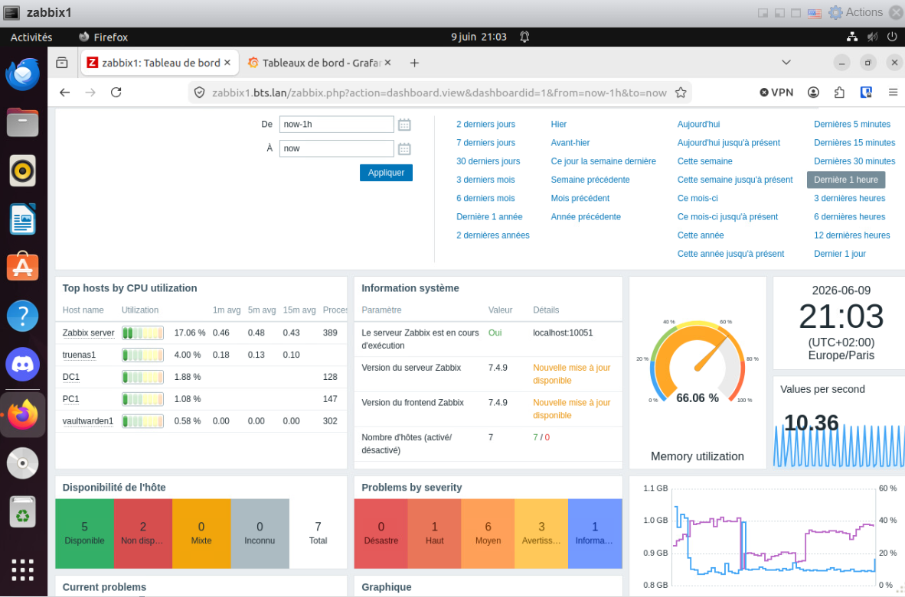

## 13 - Création des actions d’alerte par mail


### 13.1 - Activer le 2FA

```
> Aller sur https://myaccount.google.com/security
> Activer la validation en deux étapes si ce n’est pas déjà fait
```

### 13.2 - Génération d’un mot de passe d’application Gmail pour Zabbix (SMTP)

```
> Aller sur https://myaccount.google.com/apppasswords
> App Name : Zabbix
> Create
> Copier le mot de passe
```

### 13.3 - Configuration du type de média Email Gmail (SMTP) dans Zabbix

```
> Alertes
> Type de media
> Email
> Nom : Alerte Mail via Gmail
> Type : Courriel
> Fournisseur : Generic SMTP
> Serveur SMTP : smtp.gmail.com
> Port du serveur SMTP : 587
> Courriel : c.xxxxxxxxxxxxxx@gmail.com
> SMTP helo : gmail.com
> Sécurité de la connexion : STARTTLS
> Authentification : 
  > Nom d'utilisateur : c.xxxxxxxxxxxxxx@gmail.com
  > Mot de passe : coller le mot de passe sans les espaces
> Cocher Activé
> Actualiser
```

### 13.4 - Configuration du média Email pour l’utilisateur Admin (Zabbix)

```
 > Utilisateurs 
  > Utilisateurs 
  > Cliquer sur Admin 
  > Cliquer sur l'onglet Média 
  > Cliquer sur ajouter 
  > Envoyer à : c.xxxxxxxxxxxxxx@gmail.com 
  > Laisser par défaut ou personnaliser le reste des champs selon les besoins
  > Cliquer sur Ajouter 
  > Cliquer sur Actualiser
```

### 13.5 - Configuration d’une action de déclencheur pour l’envoi d’alertes (Zabbix)

```
> Alertes
> Actions
> Actions de déclencheurs
> Report problems to Zabbix administrators
> Aller dans l'onglet Operations
> Dans le champs Opérations
  > Ajouter
  > Actualiser
```
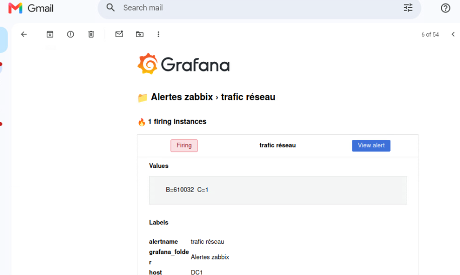


### 13.6 - Réalisation de test

```
> Désactiver l'agent zabbix sur une VM qui est monitorée OU Eteindre cette VM
> Aller dans Gmail, une notification est envoyée et reçue
```
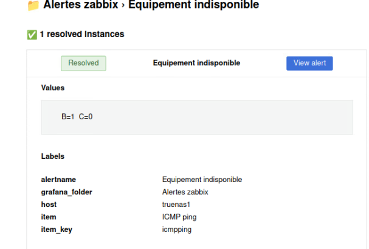

## 14 - Mise en place d'une alerte via Discord

### 14.1 - Création du webhook sur Discord

```
> créer un compte sur Discord
> Créer un serveur nommé Zabbix
> Créer un salon nommé Alertes
> Créer un webhook Discord
  > Paramètres du salon
  > Intégrations
  > Webhooks
  > Créer un webhook
  > Cliquer sur le webhook
  > Cliquer sur Copier l'URL du webhook
```

### 14.2 - Configuration du type de média Discord (Webhook) dans Zabbix

#### Création du média Discord
```
> Alertes
> Type de media
> Cliquer sur Discord
> Nom : Alerte via Discord
> Type : Webhook
> Dans Paramètres, aller sur le champs Zabbix_url et copier sa valeur {$ZABBIX.URL}
> Actualiser
```

#### Définition de la macro globale {$ZABBIX.URL} dans Zabbix

```
> Administration
> Macro
> Ajouter
> Dans Macro Coller {$ZABBIX.URL} et dans la valeur mettre https://zabbix1.bts.lan/zabbix
> Actualiser
```

#### Association du webhook Discord à l’utilisateur Admin (média Zabbix)

```
> Utilisateurs
> Utilisateurs
> Cliquer sur Admin
> Aller dans l'onglet média
> Cliquer sur Ajouter
  > Type : Discord
  > Envoyer à : coller l'url du webbhook de Discord
  > Laisser toutes les autres cases cochées
> Actualiser
```

#### Configuration des opérations d’alerte (déclencheur, récupération, mise à jour) dans Zabbix

```
> Alertes
> Actions 
> Actions de déclencheur
> Dans la zone Opérations
  > Cliquer sur Report problems to Zabbix administrators
  > Allez dans l'onhglet Opérations et cliquer sur Edition
  > Envoyer au groupe d'utilisateurs : Zabbix Administrators
  > Envoyer au type de média : Tous disponible
> Dans la zone Opération de récupération
  > Cliquer sur Report problems to Zabbix administrators
  > Allez dans l'onglet Opérations et cliquer sur Edition
  > Envoyer au groupe d'utilisateurs : Zabbix Administrators
  > Envoyer au type de média : Tous disponible
> Dans la zone Opération de mise à jour
  > Cliquer sur Report problems to Zabbix administrators
  > Allez dans l'onglet Opérations et cliquer sur Edition
  > Envoyer au groupe d'utilisateurs : Zabbix Administrators
  > Envoyer au type de média : Tous disponible
> Actualiser
```


#### Test des notifications Zabbix (mail et Discord) par arrêt de l’agent

```
> Faire un test : stopper l'agent zabbix sur une vm (ex: vaultwarden)
> Une notification par mail et par Discord est envoyée
```
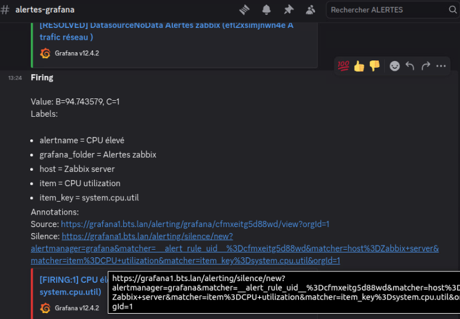

## 15 - Installation et configuration de Grafana

### 15.1 - Installation 

```bash
rm -f /var/lib/dpkg/lock-frontend
```

```bash
rm -f /var/lib/dpkg/lock
```

```bash
dpkg --configure -a
```

```bash
apt update && apt upgrade -y
```

```bash
apt install -y gnupg2 software-properties-common
```

```bash
mkdir -p /etc/apt/keyrings
```

```bash
apt install curl -y
```

```bash
curl -fsSL https://packages.grafana.com/gpg.key | gpg --dearmor | tee /etc/apt/keyrings/grafana.gpg > /dev/null
```

```bash
chmod a+r /etc/apt/keyrings/grafana.gpg
```

```bash
echo "deb [signed-by=/etc/apt/keyrings/grafana.gpg] https://packages.grafana.com/oss/deb stable main" | tee /etc/apt/sources.list.d/grafana.list > /dev/null
```

```bash
apt update
```

```bash
apt-get install -y adduser libfontconfig1 musl
```

```bash
wget https://dl.grafana.com/grafana-enterprise/release/12.4.3/grafana-enterprise_12.4.3_24388279614_linux_amd64.deb
```

```bash
dpkg -i grafana-enterprise_12.4.3_24388279614_linux_amd64.deb
```

```bash
systemctl enable grafana-server && systemctl start grafana-server && systemctl status grafana-server 
```

### 15.2 - Test

```
> Ouvrir dans ton navigateur http://192.168.40.40:3000

> Identifiants par défaut : admin / admin

> Il sera demandé de changer le mot de passe.
```

### 15.3 - Configuration du DNS sur l'AD

Dans l'active directory au niveau DNS ajouter un nouvel hôte
grafana1.bts.lan → 192.168.40.40


### 15.4 - Mise en place du HTTPS

#### Créer le certificat Grafana

Créer le fichier de config

```bash
vi /etc/ssl/apache/openssl-grafana.cnf
```

```bash
[req]
distinguished_name=req_distinguished_name
req_extensions=v3_req
prompt=no

[req_distinguished_name]
C=FR
ST=Ile-de-France
L=Paris
O=bts
OU=IT
CN=grafana1.bts.lan

[v3_req]
subjectAltName=@alt_names

[alt_names]
DNS.1=grafana1.bts.lan
```

Générer la clé privée

```bash
openssl genrsa -out /etc/ssl/apache/grafana.key 2048
```

Générer la CSR

```bash
openssl req -new \
-key /etc/ssl/apache/grafana.key \
-out /etc/ssl/apache/grafana.csr \
-config /etc/ssl/apache/openssl-grafana.cnf
```

Signer avec le Certificat d'Autorité

```bash
openssl x509 -req \
-in /etc/ssl/apache/grafana.csr \
-CA /etc/ssl/ca/ca.crt \
-CAkey /etc/ssl/ca/ca.key \
-CAcreateserial \
-out /etc/ssl/apache/grafana.crt \
-days 365 \
-extensions v3_req \
-extfile /etc/ssl/apache/openssl-grafana.cnf
```

Vérifier le certificat


```bash
openssl x509 -in /etc/ssl/apache/grafana.crt -text -noout
```

#### Configuration Apache (Reverse Proxy)

Activer modules

```bash
a2enmod ssl
a2enmod proxy
a2enmod proxy_http
a2enmod headers
```

Créer VirtualHost

```bash
vi /etc/apache2/sites-available/grafana.conf
```
```bash
<VirtualHost *:80>
    ServerName grafana1.bts.lan
    Redirect permanent / https://grafana1.bts.lan/
</VirtualHost>

<VirtualHost *:443>
    ServerName grafana.bts.lan

    SSLEngine on
    SSLCertificateFile /etc/ssl/apache/grafana.crt
    SSLCertificateKeyFile /etc/ssl/apache/grafana.key
    SSLCACertificateFile /etc/ssl/ca/ca.crt

    ProxyPreserveHost On
    ProxyPass / http://127.0.0.1:3000/
    ProxyPassReverse / http://127.0.0.1:3000/

    RequestHeader set X-Forwarded-Proto ""
</VirtualHost>
```

Activer le site

```bash
a2ensite grafana.conf
```

Vérifier config

```bash
apachectl configtest
```

Reload Apache

```bash
systemctl reload apache2
```

### 15.5 - Configuration de Grafana

#### Modification du fichier ini

```bash
vi /etc/grafana/grafana.ini
```


Modifier ces lignes dans le champs [server] :

```
domain = grafana1.bts.lan
root_url = https://grafana1.bts.lan/
serve_from_sub_path = false
http_addr = 127.0.0.1
http_port = 3000
```

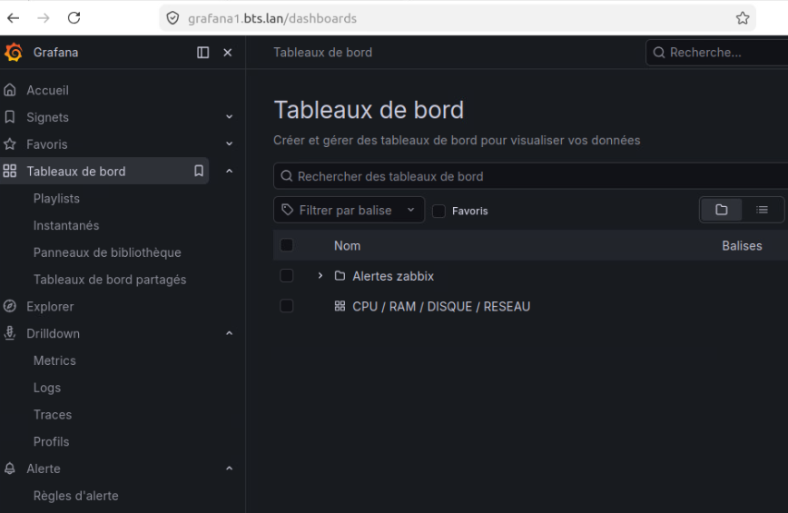

#### Installation du plugin Zabbix pour Grafana

```bash
grafana-cli plugins install alexanderzobnin-zabbix-app 6.3.2
```


```bash
systemctl restart grafana-server && systemctl status grafana-server
```


#### Configuration du client


Installer la CA sur la machine

```bash
cp /etc/ssl/ca/ca.crt /usr/local/share/ca-certificates/grafana-ca.crt
```

```bash
sudo update-ca-certificates
```

Normalement le certificat d'autorité a déjà été importée dans le navigateur plus haut

Vérifier que HTTPS fonctionne : 

```bash
curl https://grafana1.bts.lan
```

Accéder à : https://grafana1.bts.lan


#### Dans Zabbix, création de l'utilisateur Grafana

L’utilisateur grafana va permettre à Grafana d’accéder à l’API Zabbix pour récupérer les données de supervision

```
> Utilisateurs
    > Utilisateurs
        > Onglet Utilisateur
            > Nom d'utilisateur : Grafana
            > Mot de passe : ******
        > Onglet permission
            > Rôle : User role
        > Ajouter
> Utilisateurs
    > Groupes d'utilisateurs
        > Créer un groupe d'utilisateurs
            > Onglet Groupe d'utilisateurs
                > Nom du groupe : Grafana_ReadOnly
                > Utilisateurs : Grafana
                > Accès à l'interface : Interne
            > Onglet Autorisations de l'hôte
                Cliquer sur Ajouter
                > Cliquer sur Sélectionner
                > Cocher Nom
                > Cliquer sur Sélectionner
                > Cliquer sur Lecture
        > Ajouter
```

#### Dans Zabbix, mettre en place un Token API

```
> Utilisateurs
    > Tokens API
    > Créer un Token API
        > Nom : api_grafana
        > Utilisateur : sélectionner grafana
        > Décocher Définir la date et l'heure d'expiration
        > Laisser cocher Activé
        > Cliquer sur Ajouter
        > Copier le Token d'authentification
        > Cliquer sur Fermer

```

#### Sur Grafana : Mettre en français

```
> Administration
> General
> Default preferences
> Language : Français
> Save preferences
> Save
```

#### Sur Grafana : Activation du plugin dans l’interface

```
> Administration
> Modules complémentaires et données
> Cliquer sur Plug-ins
> Rechercher "Zabbix"
> Cliquer dessus
> Cliquer sur Installer
> Cliquer sur Activer
```
#### Ajout de la source de données Zabbix

```
> Connexions
> Sources de données
> Ajouter la source de données
> Rechercher "Zabbix"
> Cliquer dessus
```
```
> Name : Zabbix-CE
> URL : https://zabbix1.bts.lan/zabbix/api_jsonrpc.php
> Authentication method : No Authentication car Grafana ne s’authentifie pas au niveau HTTP mais via l’API Zabbix plus bas
> Laisser Décochés : Add self-signed certificate // TLS Client Authentication // Skip TLS certificate validation
> Auth type : Sélectionner API token
> API token : coller le Token d'authentification copié plus haut
> Enregistrer & tester
```

La validation TLS est activée afin de garantir l’intégrité et l’authenticité des communications entre Grafana et Zabbix.
La validation TLS intervient au moment où Grafana établit une connexion HTTPS avec le serveur Zabbix, avant toute authentification. Lors de cette étape, Zabbix envoie son certificat, que Grafana vérifie en s’assurant qu’il est signé par une autorité de certification reconnue (ta CA locale), que le nom du serveur correspond et que le certificat est valide. Si cette vérification est réussie, la connexion sécurisée est établie et Grafana peut ensuite s’authentifier via l’API Zabbix ; dans le cas contraire, la connexion est refusée, sauf si l’option de contournement de validation TLS est activée, ce qui est moins sécurisé.


### 15.6 - Création d'un dashboard avec 4 panels (CPU, RAM, Disque, Réseau)

#### POUR LE CPU

Le CPU (processeur) est le composant chargé d’exécuter les instructions et de traiter l’ensemble des opérations d’un système, qu’il s’agisse d’exécuter des programmes, gérer des requêtes ou effectuer des calculs. Il constitue donc le cœur du fonctionnement d’un serveur ou d’un poste de travail. Surveiller son utilisation est essentiel, car un CPU trop sollicité (proche de 100 %) peut entraîner des ralentissements, une dégradation des performances voire des interruptions de service. La supervision permet ainsi d’anticiper les surcharges, d’identifier des processus anormaux et d’assurer la disponibilité et la performance des systèmes.

```
> Tableaux de bord
> Créer un tableau de bord
> Ajouter une visualisation
> Sélectionner Zabbix-CE
> Query type : Metrics
Group : /.*/
Host : /.*/
Item : CPU utilization
À droite :
    Title : CPU
    Mode : Tableau
    Valeurs : Last et Max 
    Epaisseur de la ligne : 2
    Unité : Divers > percent (0-100)
    Seuils :
        > Mode seuils : Pourcentage
        > Afficher les seuils : En ligne
> Enregistrer le tableau de bord
> Titre : CPU / DISQUE / RAM / RESEAU
> Enregistrer
> Enregister le tableau de bord
```


#### POUR LA MEMOIRE DISPONIBLE

La mémoire RAM disponible représente la quantité de mémoire vive encore libre pour exécuter des programmes et traiter des données en cours d’utilisation. La RAM est utilisée pour stocker temporairement les informations nécessaires au fonctionnement du système et des applications, ce qui permet un accès rapide par le processeur. Surveiller la mémoire disponible est important, car une RAM saturée peut entraîner des ralentissements importants, l’utilisation excessive du swap (mémoire disque plus lente) voire des blocages du système. La supervision permet ainsi de détecter les manques de ressources, d’anticiper les besoins en capacité et d’identifier d’éventuelles anomalies comme des fuites mémoire.

```
> Tableaux de bord
> Cliquer sur CPU / DISQUE / RAM / RESEAU
> Cliquer sur le bouton Ajouter puis sur Visualisation
> Source de données : sélectionner Zabbix-CE
> Query type : Metrics
Group : /.*/
Host : /.*/
Item : Memory utilization
À droite :
    Titre : RAM
    Mode : Tableau
    Valeurs : Last et Max 
    Epaisseur de la ligne : 2
    Unité : Divers > percent (0-100)
    Seuils :
        > Mode seuils : Pourcentage
        > Afficher les seuils : En ligne
> Enregistrer le tableau de bord
> Enregistrer
> Retour au tableau de bord
```

#### POUR LE DISQUE

La supervision du disque consiste à surveiller l’activité et les performances du stockage, notamment les lectures, écritures et l’utilisation globale du disque. Le disque dur (ou SSD) est utilisé pour stocker durablement les données du système, des applications et des utilisateurs. Il est donc essentiel de le surveiller, car un disque saturé ou fortement sollicité peut entraîner des ralentissements importants, des temps de réponse élevés, voire des pertes de données ou des pannes de service. La supervision permet ainsi d’anticiper un manque d’espace, de détecter une activité anormale et de garantir la disponibilité et la fiabilité du système.

```
> Cliquer sur le bouton Ajouter puis sur Visualisation
> Create dashboard
> Add Vizualization
> Sélectionner Zabbix-CE
> Query type : Metrics
Group : /.*/
Host : /.*/
Item : sda: disk utilization
À droite :
    Titre : Disque
    Mode : Tableau
    Valeurs : Last et Max 
    Epaisseur de la ligne : 2
    Unité : Divers > percent (0-100)
    Seuils :
        > Mode seuils : Pourcentage
        > Afficher les seuils : En ligne
> Enregistrer le tableau de bord
> Enregistrer
> Retour au tableau de bord
```

Attention : pour que ca prenne aussi en compte les équipements windows, dupliquer la requete dans item, choisir 0 C:: Disk utilization byidle time  


#### POUR LE RESEAU

La supervision du réseau consiste à surveiller les flux de données entrants et sortants d’un système, ainsi que les performances de communication entre les équipements. Le réseau permet l’échange d’informations entre les serveurs, les utilisateurs et les services, ce qui en fait un élément essentiel du fonctionnement d’une infrastructure. Il est important de le surveiller, car une saturation de la bande passante, des latences élevées ou des pertes de paquets peuvent entraîner des ralentissements, des interruptions de service ou des dysfonctionnements applicatifs. La supervision permet ainsi de détecter les anomalies, d’identifier les congestions et d’assurer la qualité et la disponibilité des communications.


```
> Cliquer sur le bouton Ajouter puis sur Visualisation
> Create dashboard
> Add Vizualization
> Sélectionner Zabbix-CE
> Query type : Metrics
Group : /.*/
Host : /.*/
Item : LAN Paris Bits Sent
À droite :
    Titre : Réseau
    Mode : Tableau
    Valeurs : Last et Max 
    Epaisseur de la ligne : 2
    Unité : Divers > percent (0-100)
    Seuils :
        > Mode seuils : Pourcentage
        > Afficher les seuils : En ligne
> Enregistrer le tableau de bord
> Enregistrer
> Re

Attention : dupliquer la requete dans item, choisir ens33: Bits received
```
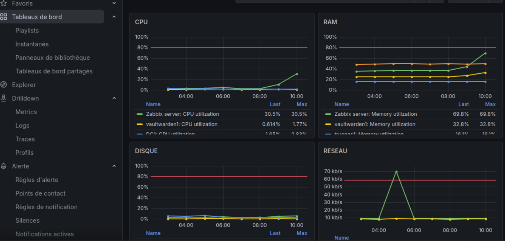


## 16 - Réalisation d'un script de sauvegarde

Il s'agit d'un script générique applicable sur chaque serveur (Zabbix, Postfix, DNS, etc.).

Le script :

- sauvegarde la configuration du serveur

- envoie la sauvegarde sur TrueNAS

- garde X jours de sauvegarde (rotation)

- écrit un log

- fonctionne avec cron


### 16.1 - Monter le partage TrueNAS si ce n'est pas déjà fait

Faire ```df -h``` pour vérifier que le partage est déjà crée et monté.

Si ce n'est pas le cas, suivre la procédure plus haut.


### 16.2 - Chiffrement avec GPG

Installer GPG

```bash
apt install gnupg -y
```

Créer une clé de chiffrement

```bash
gpg --full-generate-key
```
Choisir 1
Saisir 4096
Pendant combien de temps la clef est-elle valable ? (0) : 0
Nom réel : backup_server
Adresse électronique : c.xxxxxxxxxxxxxx@gmail.com
Phrase secrète : ******

### 16.3 - Créer le script générique

```bash
vi /usr/local/bin/backup_server.sh
```

```bash
#!/bin/bash

DATE=$(date +%F)
HOST=$(hostname)
BACKUP_ROOT="/backup"
BACKUP_DIR="$BACKUP_ROOT/$HOST"
LOG="/var/log/backup_server.log"
MAIL="c.xxxxxxxxxxxxxx@gmail.com"
GPG_RECIPIENT="backup_server"

# Vérifier que le NAS est monté
if ! mountpoint -q "$BACKUP_ROOT"; then
    echo "[$(date)] ERREUR : NAS non monté" | tee -a $LOG
    echo "Backup FAILED : NAS non monté sur $HOST" | mail -s "Backup ERROR $HOST" $MAIL
    exit 1
fi

mkdir -p $BACKUP_DIR

echo "[$(date)] Début sauvegarde $HOST" >> $LOG

# Sauvegarde configuration système (compressée + chiffrée)
tar -cz /etc | \
gpg --encrypt --recipient "$GPG_RECIPIENT" \
--output $BACKUP_DIR/${HOST}_etc_$DATE.tar.gz.gpg \
&>> $LOG

# Sauvegarde dossiers utilisateurs
tar -cz /home | \
gpg --encrypt --recipient "$GPG_RECIPIENT" \
--output $BACKUP_DIR/${HOST}_home_$DATE.tar.gz.gpg \
&>> $LOG

# Sauvegarde bases MariaDB/MySQL
if command -v mysqldump &> /dev/null
then
    echo "Sauvegarde bases MySQL..." >> $LOG

    for DB in $(mysql -N -e "SHOW DATABASES" -s --skip-column-names); do
        if [[ "$DB" != "information_schema" && "$DB" != "performance_schema" ]]; then

            mysqldump $DB | gzip | \
            gpg --encrypt --recipient "$GPG_RECIPIENT" \
            --output $BACKUP_DIR/${HOST}_${DB}_$DATE.sql.gz.gpg \
            &>> $LOG

        fi
    done
fi

echo "[$(date)] Sauvegarde terminée" >> $LOG

# Rotation sauvegardes > 7 jours
find "$BACKUP_DIR" -type f -name "*.gpg" -mtime +7 -delete

echo "[$(date)] Rotation effectuée" >> $LOG
```

Rendre le script exécutable

```bash
chmod +x /usr/local/bin/backup_server.sh
```

Tester le script

```bash
/usr/local/bin/backup_server.sh
```

Vérifier 

```bash
ls /backup
```

Les fichiers vont apparaitre dans le dossier zabbix1


### 16.4 - Automatiser avec cron

crontab -e

Ajouter

```bash
0 2 * * * /usr/local/bin/backup_server.sh
```

Pour tester rapidement que ca fonctionne on peut mettre à la place la commande suivante afin que ca sauvegarde toutes les 05 minutes


```bash
*/5 * * * * /usr/local/bin/backup_server.sh
```


## 17 - Restauration

### 17.1 - Sur le serveur Zabbix

Arrêter Zabbix

```bash
systemctl stop zabbix-server
```

Se connecter à MySQL

```bash
mysql
```

Supprimer la base Zabbix

```bash
DROP DATABASE zabbix;
```

Recréer la base

```bash
CREATE DATABASE zabbix
CHARACTER SET utf8
COLLATE utf8mb4_bin;
```

Puis quitter :

```bash
exit
```

Aller sur zabbix1.bts.lan
On voit que la base de données est supprimée


Maintenant on va restaurer la sauvegarde

```bash
gpg --decrypt /backup/zabbix1/zabbix1_zabbix_2026-03-12.sql.gz.gpg | gunzip | mysql zabbix
```

On redemarre Zabbix

```bash
systemctl start zabbix-server
```


### 17.2 - Vérification de la restauration

#### via MySQl

```bash
mysql
```

```bash
USE zabbix;
```
```bash
SHOW TABLES;
```

On constate qu'il y a de nouveau des tables donc la restauration a fonctionné.


#### Via l'interface web de Zabbix

Et on peut le voir graphiquement en allant sur zabbix : zabbix1.bts.lan


## 18 - Commandes utiles

Vérifier les logs

```bash
cat /var/log/backup_server.log
```

Déchiffrer une sauvegarde

```bash
gpg --decrypt /backup/zabbix1/zabbix1_zabbix_2026-03-12.sql.gz.gpg > zabbix.sql.gz
```

Décompresser la sauvegarde :

```bash
gunzip zabbix.sql.gz
```

## 19 - Tests réalisés et Résultats obtenus
1. Désactiver l'agent zabbix sur une des VMs :
```bash:
 systemctl stop zabbix-agent
```
*Resultat* 

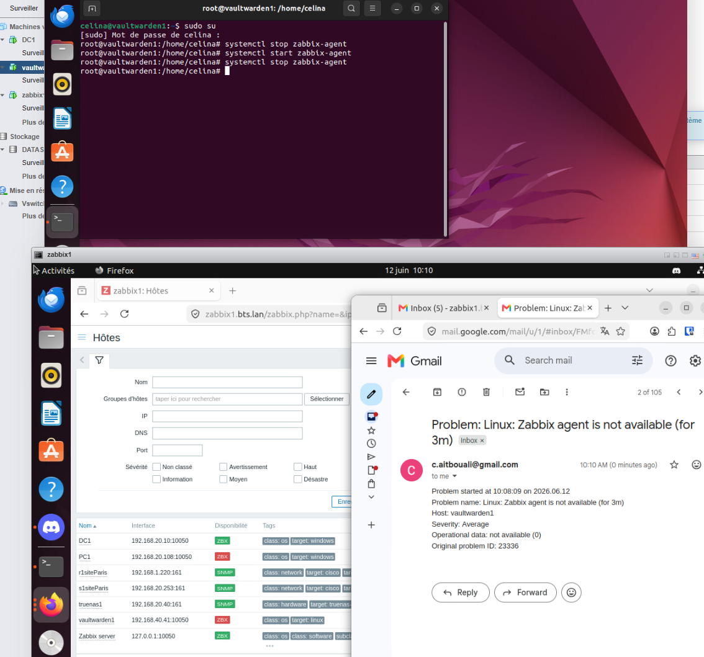

2. Sauvegarde et Restauration :
```bash:

 - Lancer la sauvegarde :
    # /usr/local/bin/backup_server.sh
 - verification fichier créer sur NAS :
    # ls -lh /backup/zabbix1/
```
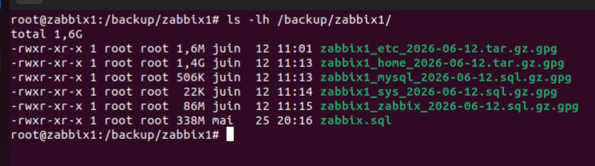

```bash:
 - Restauration:

 # Arrêter Zabbix
systemctl stop zabbix-server

# Supprimer la base
mysql -e "DROP DATABASE zabbix;"

# Recréer la base vide
mysql -e "CREATE DATABASE zabbix CHARACTER SET utf8mb4 COLLATE utf8mb4_bin;"

# Restaurer (tape ta phrase secrète GPG quand demandé)
gpg --decrypt /backup/zabbix1/zabbix1_zabbix_$(date +%F).sql.gz.gpg | gunzip | mysql zabbix

# Vérifier les tables
mysql -e "USE zabbix; SHOW TABLES;" | wc -l
# Attendu : ~170

# Redémarrer Zabbix
systemctl start zabbix-server
```

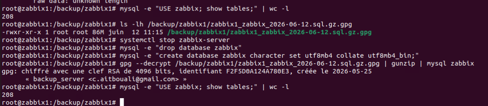

## 20 - Difficultés rencontrées

## Création d'un item personnalisé pour la supervision du switch

- Le template disponible ne correspondant pas au switch, un item personnalisé a été créé manuellement dans Zabbix avec les OID appropriés : 48.1.0

## Connexion de grafana vers zabbix

- La connexion par identifiant/mot de passe n'étant pas fonctionnelle, On a fait via un token API qui a été utilisé à la place

## 21 - Conclusion

La mise en place de Zabbix et Grafana a permis d'améliorer la supervision, la sécurité et la disponibilité de l'infrastructure. Ce projet m'a permis de mettre en pratique les compétences acquises durant ma formation BTS SIO SISR dans un contexte concret d'administration systèmes et réseaux.
